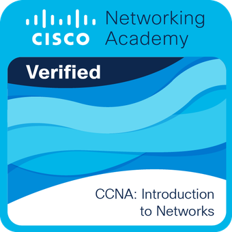

# Olá, eu sou Danilo Celestino

Programador e estudante de Ciência da Computação  
Sempre aprendendo e evoluindo  
Brasil  

---

## Linguagens que uso

---

##  Certificação

### Badge Oficial (Credly)

🔗 **Ver certificado completo:**  
https://www.credly.com/badges/688e9e22-53a5-4fa5-bb20-bd171068e312

---

##  Contato

📧 danilo.celestino5@gmail.com  
🔗 LinkedIn: https://www.linkedin.com/in/danilo-celestino  

---

##  Objetivo

Contribuir com projetos open source, trabalhar com projetos internacionais e compartilhar conhecimento com a comunidade.
